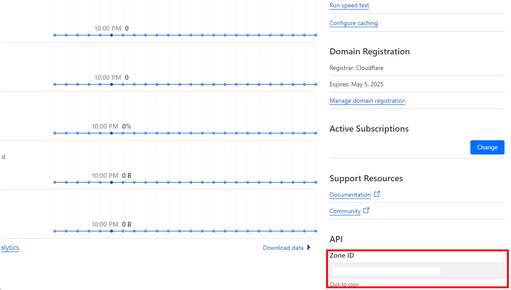

# GoDDNSClient

This is a simple command line tool used to update DNS records. It was created to ease the pain of hosting things from a residential connection where a dynamic IP address is common (atleast in USA). Currently only cloudflare is supported.

## How to use?

The indended way to use this tool is to have something else run it periodically (EG Chrontab for linux or Task Scheduler for windows). It only updates the records if your IP address changes from what is in its included config file.

## Setup

At a minimum you need to configure the email, api access token and atleast one domain's name and zone id.

### Email

The email is the account that has the authority to change the DNS record. Typically this is the email you login with.

### API Access Token

This is the access token that you can find in your account on <a href="https://dash.cloudflare.com/profile/api-tokens">Cloudflare's Dashboard</a>

### Domain Name

The domain name to be updated. This is whatever the A record is. If the base domain is example.com and you want to update www.example.com you would put www.example.com here.

### Domain Zone Id

This can be found on your domains dashboard in the lower right side.

## Command Arguments

These agurments can be used to change values in the configuration file via the command line.

- **-add-site**
  - Type : Flag
  - Description : Set this to true to add a new site to the config, must be used in conjunction with site-name and site-zone.
- **-force**
  - Type : Flage
  - Description : Set this to force the update regardless if the config has the current IP address.
- **-reset-config**
  - Type : Flag
  - Description : Set this to true to reset the config to the default. **_This will overwrite everything. Make sure to make backups if you wish to save parts of the old config._**
- **-config-name**
  - Type : String
  - Description : The name of the config file you want to use. Defaults to config.json (default "config.json")
- **-email**
  - Type : String
  - Description : Sets the email in the config file (default "default@default.com")
- **-ip**
  - Type : String
  - Description : A string representing the IP address you want to start this with, will be overwritten by the current one. (default "0.0.0.0"). If you use this everytime you can just mandate a specific IP address regardless of what IP the machine has.
- **-site-name**
  - Type : String
  - Description : Used in conjuction with add-site to configure the site name
- **-site-zone**
  - Type : String
  - Description : Used in conjuction with add-site to configure the site zone
- **-token**
  - Type : String
  - Description : Sets the API access token in the config file (default "API Access token")

### Config File

This is the configuration which is standard JSON. The domains is a list of all the domains you want to be updated by this application. You can modify this directly if you do not wish to use the command line arguments. 

